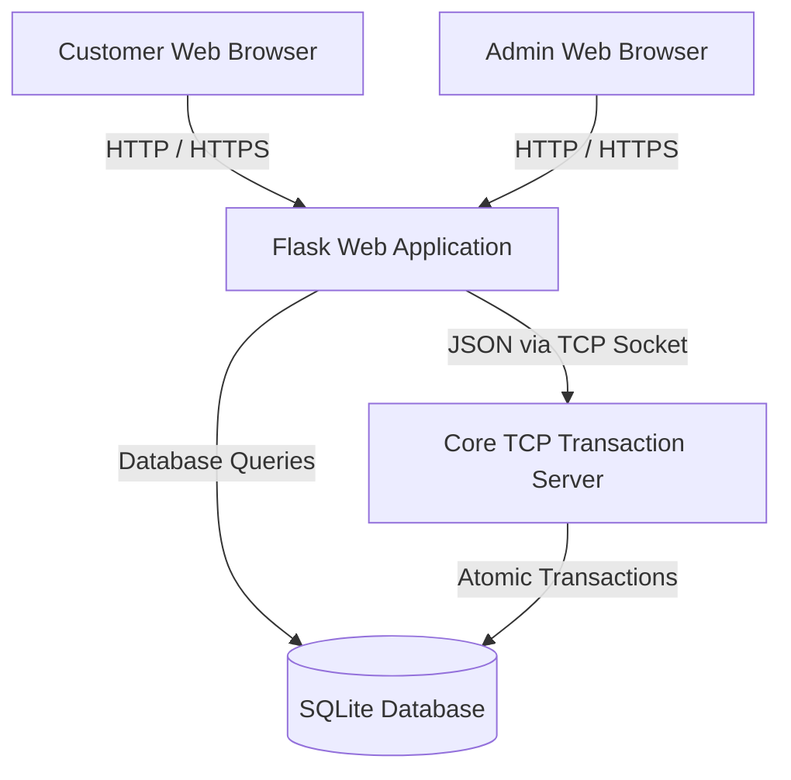
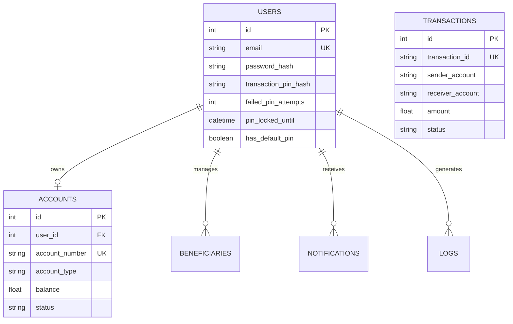
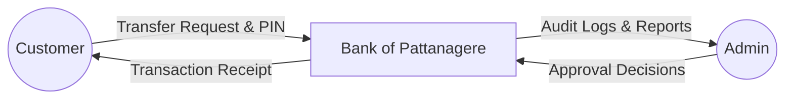
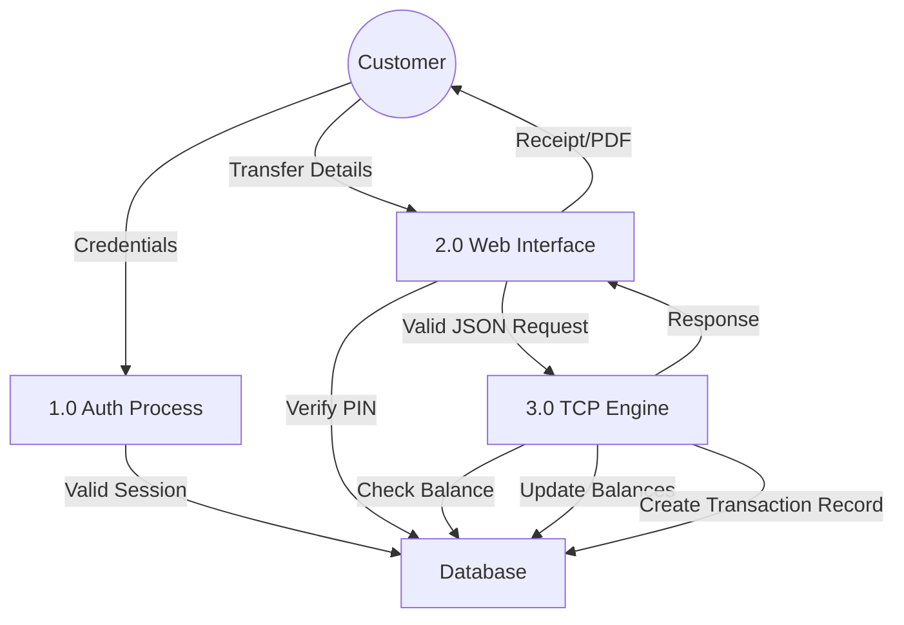
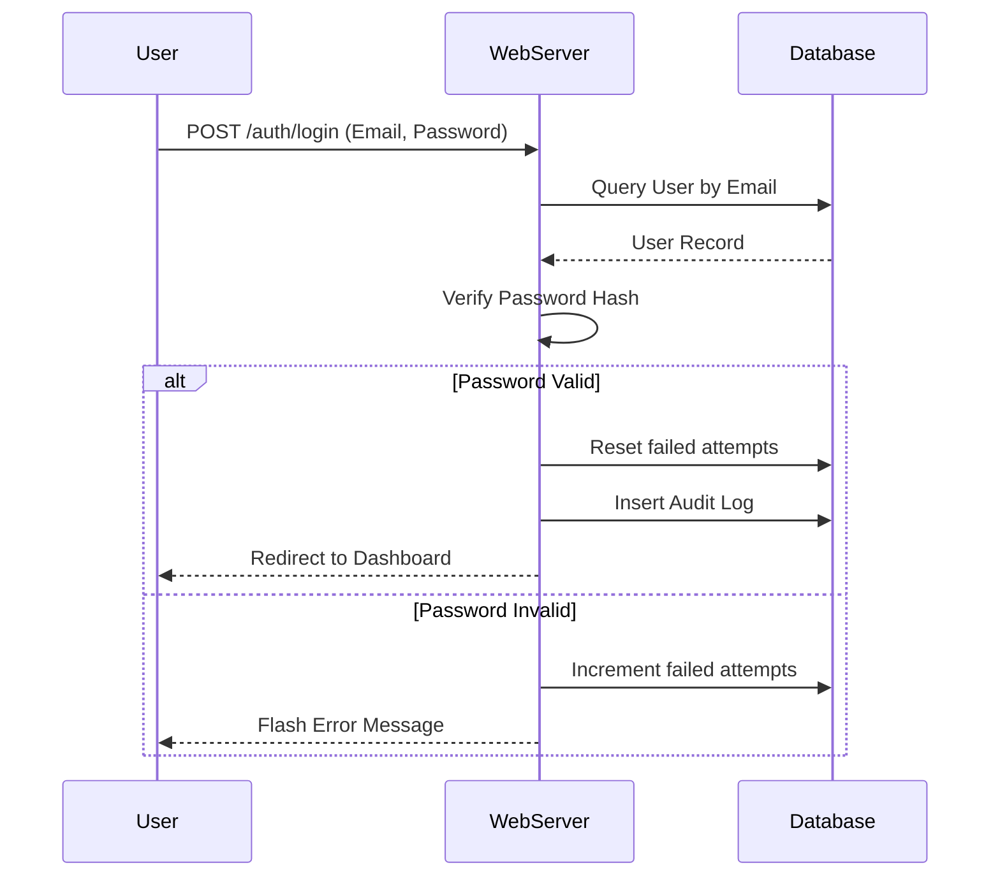
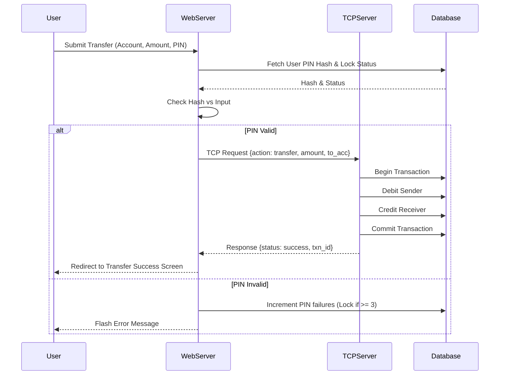

# Bank of Pattanagere
## Real-Time Banking Transaction System Using TCP

---

## Table of Contents
1. [Abstract](#1-abstract)
2. [Introduction](#2-introduction)
3. [Problem Statement](#3-problem-statement)
4. [Objectives](#4-objectives)
5. [Existing System](#5-existing-system)
6. [Proposed System](#6-proposed-system)
7. [System Architecture](#7-system-architecture)
8. [Technology Stack](#8-technology-stack)
9. [Module Description](#9-module-description)
10. [Database Design](#10-database-design)
11. [Network Topology](#11-network-topology)
12. [Use Case Diagram](#12-use-case-diagram)
13. [Data Flow Diagram](#13-data-flow-diagram)
14. [Sequence Diagrams](#14-sequence-diagrams)
15. [Security Features](#15-security-features)
16. [Testing](#16-testing)
17. [Screenshots](#17-screenshots)
18. [Results](#18-results)
19. [Conclusion](#19-conclusion)
20. [Future Enhancements](#20-future-enhancements)

---

# 1. Abstract

The Bank of Pattanagere project presents a robust, secure, and real-time digital banking transaction system. It addresses the need for high-performance financial data processing by decoupling the customer-facing web interface from the core banking operations. A traditional web server handles user authentication, profile management, and data visualization, while a dedicated multithreaded TCP server strictly manages the atomicity, consistency, isolation, and durability (ACID) properties of financial transactions. By integrating multi-layered security controls, including strict Password and Transaction PIN authentication layers with lock-out mechanisms, the system successfully emulates a real-world enterprise banking network.

---

# 2. Introduction

In the modern digital era, banking systems must provide uninterrupted, secure, and real-time access to financial services. As transaction volumes grow and security threats become more sophisticated, monolithic web applications struggle to provide the necessary concurrency and isolation for core banking operations. The Bank of Pattanagere system is designed to provide a seamless customer experience through a modern web interface while ensuring that critical financial operations—such as balance inquiries and fund transfers—are executed by an independent, high-performance TCP transaction engine.

---

# 3. Problem Statement

Traditional monolithic banking web applications often handle both user interface rendering and critical transaction processing within the same execution thread or process space. This tightly coupled architecture leads to several challenges:
* **Concurrency Issues:** Simultaneous transaction requests can lead to race conditions or deadlocks.
* **Security Vulnerabilities:** Single-layered authentication means compromising a user's web session directly grants access to financial operations.
* **Scalability Bottlenecks:** Heavy web traffic can slow down core transaction processing.
* **Lack of Atomicity:** Inadequate transaction isolation can result in partial updates, leading to data inconsistency.

---

# 4. Objectives

* **Decoupled Architecture:** To separate the user interface (Flask) from the core transaction processing engine (TCP Server) for better scalability and security.
* **Real-Time Processing:** To facilitate instantaneous fund transfers and real-time balance inquiries using persistent socket connections.
* **Enhanced Security:** To implement dual-layer authentication, requiring both a login password and a dedicated 4-digit Transaction PIN for monetary operations.
* **Data Integrity:** To ensure ACID properties across all financial transactions using relational database constraints and programmatic locks.
* **Comprehensive Audit Trail:** To maintain detailed logs and transaction histories for all user and system activities.

---

# 5. Existing System

Many existing academic or small-scale banking applications rely entirely on synchronous HTTP requests to perform database updates. In these systems, when a user initiates a transfer, the web server directly alters account balances. These systems lack dedicated transaction engines, do not emulate real banking network topologies, and typically rely solely on a single login password to authorize sensitive fund transfers, making them vulnerable to session hijacking and race conditions.

---

# 6. Proposed System

The proposed Bank of Pattanagere system introduces a distributed architecture approach. The web application (Client) serves as the presentation layer, handling user sessions, dashboards, and form validations. When a user authorizes a transaction via their Transaction PIN, the web application acts as a TCP client, communicating the transaction payload to an independent TCP Server. The TCP Server processes the financial logic, updates the database securely, and returns a success or failure status back to the web application.

---

# 7. System Architecture

The architecture is divided into three primary tiers: the Presentation Layer (Client Browser), the Application Layer (Flask Web Server), and the Core Processing Layer (TCP Transaction Server). Both the Web Server and the TCP Server interact with a centralized Database Layer.



**Architecture Explanation:**
1. **Client Browser:** Handles the UI rendering (Tailwind CSS) and client-side form validations.
2. **Flask Web Application:** Manages authentication, session state, UI templating, and routing. Validates the Transaction PIN before sending requests to the TCP Server.
3. **TCP Transaction Server:** A multithreaded daemon that listens on a specific port. It exclusively handles `balance` and `transfer` commands, ensuring atomicity.
4. **SQLite Database:** The persistent storage layer accessible by both the Flask app and the TCP Server using SQLAlchemy ORM.

---

# 8. Technology Stack

* **Frontend:** HTML5, Tailwind CSS, JavaScript
* **Backend Web Framework:** Python (Flask), Flask-Login
* **Core Transaction Server:** Python native `socket` and `threading` libraries
* **Database & ORM:** SQLite, Flask-SQLAlchemy
* **Security:** Werkzeug Security (scrypt hashing for passwords and PINs)
* **Reporting:** ReportLab (for PDF receipt generation)

---

# 9. Module Description

* **Authentication Module:** Manages user registration, login, logout, password hashing, and session tracking. Includes lockout mechanisms after multiple failed attempts.
* **Customer Module:** Provides the customer dashboard, displaying account summaries, recent transactions, and system notifications.
* **Admin Module:** Handles user approvals, account management, system-wide analytics, and audit log reviews.
* **Account Management Module:** Manages user accounts (Savings/Current), tracks balances, and handles account statuses (Active, Pending, Frozen).
* **Beneficiary Module:** Allows customers to save, view, and delete frequent transfer recipients.
* **Transaction Module:** Handles the web-interface logic for initiating transfers, generating reference numbers, rendering receipts, and exporting mini-statements (CSV/PDF).
* **Transaction PIN Module:** Provides a secondary layer of security requiring a 4-digit numeric PIN for authorizing fund transfers. Includes its own lockout counters and reset flows.
* **Audit Logging Module:** Silently records all critical system events (logins, PIN changes, lockouts, transfers) for administrative review.
* **TCP Communication Module:** The bridge between the Flask app and the TCP Server, handling socket connections, JSON serialization, and response parsing.

---

# 10. Database Design

The relational database relies on Foreign Key constraints to ensure referential integrity.



**Table Descriptions:**
* **Users:** Stores personal details, authentication hashes, and lockout timers.
* **Accounts:** Links to Users. Stores the structured `101560001XXXXXX` account number, balance, and operational status.
* **Transactions:** Records all financial movements. Isolated into sender/receiver perspectives for correct transaction history representation.
* **Beneficiaries:** Stores saved accounts for quick transfers.
* **Notifications & Logs:** Stores system alerts and audit trails.

---

# 11. Network Topology

The system emulates a distributed banking topology.

1. **Web Client Node:** Connects to the Web Server via HTTP over port 5000.
2. **Flask Node (Application Server):** Connects to the Database Node via SQLAlchemy URI and to the TCP Server Node via a localized socket (e.g., `127.0.0.1:65432`).
3. **TCP Server Node:** A multithreaded daemon listening on `TCP port 65432`. It spawns a new thread for every incoming socket connection, processes the JSON payload, queries the DB, and returns a JSON response.

---

# 12. Use Case Diagram

```mermaid
usecaseDiagram
    actor Customer
    actor Admin
    
    package "Bank of Pattanagere System" {
        usecase "Login / Register" as UC1
        usecase "View Dashboard" as UC2
        usecase "Transfer Funds" as UC3
        usecase "Verify Transaction PIN" as UC4
        usecase "View/Download Receipt" as UC5
        usecase "Manage Beneficiaries" as UC6
        usecase "Reset PIN / Password" as UC7
        usecase "Approve Accounts" as UC8
        usecase "View Audit Logs" as UC9
    }
    
    Customer --> UC1
    Customer --> UC2
    Customer --> UC3
    UC3 ..> UC4 : <<includes>>
    Customer --> UC5
    Customer --> UC6
    Customer --> UC7
    
    Admin --> UC1
    Admin --> UC8
    Admin --> UC9
```

---

# 13. Data Flow Diagram

### Level 0 DFD (Context Diagram)



### Level 1 DFD



---

# 14. Sequence Diagrams

### Login Sequence



### Fund Transfer & PIN Sequence



---

# 15. Security Features

* **Password Hashing:** Uses `scrypt:32768:8:1` for both user passwords and Transaction PINs, preventing plaintext exposure in the database.
* **Transaction PIN Authentication:** Completely isolates web-session access from financial access. A hijacked web session cannot move funds without the separate 4-digit PIN.
* **Concurrency Protection & Transaction Integrity:** To prevent Double Spending, Race Conditions, and Lost Updates, the TCP server enforces strict database-level atomic operations. Rather than modifying balances in application memory, the system executes atomic SQL `UPDATE` statements that calculate the new balance natively within the database engine (e.g., `UPDATE accounts SET balance = balance - amount WHERE balance >= amount`). This ensures that even under massive concurrent load (e.g., simultaneous HTTP or TCP requests), only one transaction can successfully reduce a specific balance, completely preventing negative balances and double-spending scenarios.
* **Account Locking Mechanisms:** Three consecutive failed PIN attempts trigger a 15-minute freeze on financial operations. Similar lockouts exist for standard web logins.
* **Session Management:** Utilizes Flask-Login for secure, encrypted session cookies that expire appropriately.
* **Role-Based Access Control (RBAC):** Strict segregation between `customer` and `admin` routes using `@login_required` and role-checking decorators.
* **Audit Logging:** The `logs` table silently tracks all IP addresses, system actions, password changes, and lockouts, providing an immutable history for forensic review.

---

# 16. Testing

### Test Cases

| Test ID | Module | Scenario | Expected Result | Result |
|---------|--------|----------|-----------------|---------|
| TC01 | Auth | Login with incorrect password | Increment failed attempts counter | Pass |
| TC02 | Auth | Login with correct credentials | Redirect to customer dashboard | Pass |
| TC03 | Transfer | Transfer with Insufficient Balance | Reject transfer, flash error | Pass |
| TC04 | Security | Enter incorrect Transaction PIN | Reject transfer, increment PIN failures | Pass |
| TC05 | Security | Enter incorrect PIN 3 times | Lock financial operations for 15 mins | Pass |
| TC06 | TCP Core | Transfer valid amount with correct PIN | Deduct sender, credit receiver, generate Receipt | Pass |
| TC07 | Profile | Reset Transaction PIN via password | Old PIN invalidated, new PIN active, log generated | Pass |

---

# 17. Screenshots

*Note: The following are descriptions of the visual interfaces provided by the system.*

* **[Login Page Placeholder]**: Features a clean, centered authentication card with a blue primary theme, input fields for email and password, and dynamic error flashing.
* **[Customer Dashboard Placeholder]**: Displays a responsive grid with Total Credits/Debits, a "Quick Transfer" card, and a list of the 5 most recent transactions with status badges.
* **[Fund Transfer Modal Placeholder]**: A modern overlay that dims the background. It summarizes the transfer details and requests the 4-digit PIN using four isolated, auto-focusing numeric input boxes (`[ • ] [ • ] [ • ] [ • ]`).
* **[Transfer Success Screen Placeholder]**: A dedicated success confirmation page featuring a large green checkmark, the system-generated Reference Number, and quick links to download the PDF receipt.
* **[PDF Transaction Receipt Placeholder]**: A dynamically generated, print-ready PDF via ReportLab, featuring the bank's logo, structured transaction tables, and disclaimer footers.

---

# 18. Results

The implementation of the decoupled Flask and TCP socket architecture resulted in a highly responsive and stable banking environment. The introduction of the Transaction PIN authorization flow successfully prevented unauthorized transfers even when test sessions were left open. The multithreaded TCP server effectively handled rapid sequential transaction requests without resulting in deadlocks or database integrity errors. All transactions generated immediate, accurate database records, and the automated PDF generation provided professional, customer-ready documentation.

---

# 19. Conclusion

The Bank of Pattanagere project successfully demonstrates the design and implementation of an enterprise-grade digital banking system. By separating the user interface operations from the core financial logic via a dedicated TCP transaction engine, the system achieves superior performance and structural integrity. The integration of modern security paradigms, notably the secondary Transaction PIN authorization, ensures the application is highly resilient against common digital threats. This project serves as a comprehensive model for building scalable, secure, and decoupled financial technologies.

---

# 20. Future Enhancements

* **OTP Integration:** Integrating SMS or Email gateways to replace or supplement the Transaction PIN with a dynamic One-Time Password.
* **Mobile Application:** Developing a React Native or Flutter mobile application that connects directly to the TCP engine and REST APIs.
* **Analytics & Cash Flow Visualization:** Implementing advanced graphing libraries (e.g., Chart.js or D3.js) to provide users with visual spending insights and administrators with network-wide cash flow topology maps.
* **AI-Based Fraud Detection:** Implementing a machine learning layer on the TCP server to analyze transaction velocity and flag anomalous patterns before committing them to the database.
* **Cloud Deployment:** Migrating the SQLite database to PostgreSQL and deploying the Flask and TCP instances as isolated Docker containers on AWS or Google Cloud.
